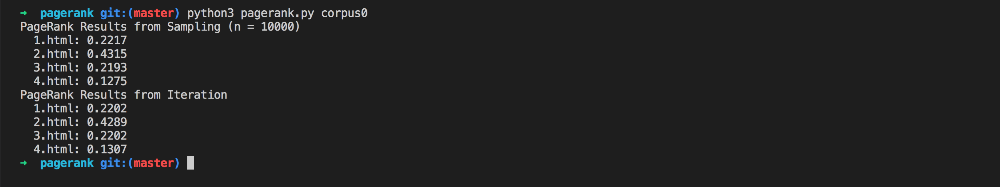

# PageRank

## An AI to rank web pages by importance

When search engines like Google display search results, they do so by placing more “important” and higher-quality pages higher in the search results than less important pages. But how does the search engine know which pages are more important than other pages?

One heuristic might be that an “important” page is one that many other pages link to, since it’s reasonable to imagine that more sites will link to a higher-quality webpage than a lower-quality webpage. We could therefore imagine a system where each page is given a rank according to the number of incoming links it has from other pages, and higher ranks would signal higher importance.

But this definition isn’t perfect: if someone wants to make their page seem more important, then under this system, they could simply create many other pages that link to their desired page to artificially inflate its rank.

For that reason, the PageRank algorithm was created by Google’s co-founders (including Larry Page, for whom the algorithm was named). In PageRank’s algorithm, a website is more important if it is linked to by other important websites, and links from less important websites have their links weighted less. This definition seems a bit circular, but it turns out that there are multiple strategies for calculating these rankings.

**Random Surfer Model**

One way to think about PageRank is with the random surfer model, which considers the behavior of a hypothetical surfer on the internet who clicks on links at random. Consider the corpus of web pages below, where an arrow between two pages indicates a link from one page to another.

The random surfer model imagines a surfer who starts with a web page at random, and then randomly chooses links to follow. If the surfer is on Page 2, for example, they would randomly choose between Page 1 and Page 3 to visit next (duplicate links on the same page are treated as a single link, and links from a page to itself are ignored as well). If they chose Page 3, the surfer would then randomly choose between Page 2 and Page 4 to visit next.

A page’s PageRank, then, can be described as the probability that a random surfer is on that page at any given time. After all, if there are more links to a particular page, then it’s more likely that a random surfer will end up on that page. Moreover, a link from a more important site is more likely to be clicked on than a link from a less important site that fewer pages link to, so this model handles weighting links by their importance as well.

One way to interpret this model is as a **Markov Chain**, where each page represents a state, and each page has a transition model that chooses among its links at random. At each time step, the state switches to one of the pages linked to by the current state.

By sampling states randomly from the Markov Chain, we can get an estimate for each page’s PageRank. We can start by choosing a page at random, then keep following links at random, keeping track of how many times we’ve visited each page. After we’ve gathered all of our samples (based on a number we choose in advance), the proportion of the time we were on each page might be an estimate for that page’s rank.

However, this definition of PageRank proves slightly problematic, if we consider a network of pages like the below.

Imagine we randomly started by sampling Page 5. We’d then have no choice but to go to Page 6, and then no choice but to go to Page 5 after that, and then Page 6 again, and so forth. We’d end up with an estimate of 0.5 for the PageRank for Pages 5 and 6, and an estimate of 0 for the PageRank of all the remaining pages, since we spent all our time on Pages 5 and 6 and never visited any of the other pages.

To ensure we can always get to somewhere else in the corpus of web pages, we’ll introduce to our model a damping factor *d*. With probability *d* (where *d* is usually set around 0.85), the random surfer will choose from one of the links on the current page at random. But otherwise (with probability *1 - d*), the random surfer chooses one out of all of the pages in the corpus at random (including the one they are currently on).

Our random surfer now starts by choosing a page at random, and then, for each additional sample we’d like to generate, chooses a link from the current page at random with probability *d*, and chooses any page at random with probability *1 - d*. If we keep track of how many times each page has shown up as a sample, we can treat the proportion of states that were on a given page as its PageRank.

**Iterative Algorithm**

We can also define a page’s PageRank using a recursive mathematical expression. Let *PR(p)* be the PageRank of a given page *p*: the probability that a random surfer ends up on that page. How do we define *PR(p)*? Well, we know there are two ways that a random surfer could end up on the page:

With probability *1 - d*, the surfer chose a page at random and ended up on page *p*.
With probability *d*, the surfer followed a link from a page *i* to page *p*.
The first condition is fairly straightforward to express mathematically: it’s *1 - d* divided by *N*, where *N* is the total number of pages across the entire corpus. This is because the *1 - d* probability of choosing a page at random is split evenly among all *N* possible pages.

For the second condition, we need to consider each possible page *i* that links to page *p*. For each of those incoming pages, let *NumLinks(i)* be the number of links on page *i*. Each page *i* that links to *p* has its own PageRank, *PR(i)*, representing the probability that we are on page *i* at any given time. And since from page *i* we travel to any of that page’s links with equal probability, we divide *PR(i)* by the number of links *NumLinks(i)* to get the probability that we were on page *i* and chose the link to page *p*.

This gives us the following definition for the PageRank for a page *p*.

In this formula, *d* is the damping factor, *N* is the total number of pages in the corpus, *i* ranges over all pages that link to page *p*, and *NumLinks(i)* is the number of links present on page *i*.

How would we go about calculating PageRank values for each page, then? We can do so via iteration: start by assuming the PageRank of every page is *1 / N* (i.e., equally likely to be on any page). Then, use the above formula to calculate new PageRank values for each page, based on the previous PageRank values. If we keep repeating this process, calculating a new set of PageRank values for each page based on the previous set of PageRank values, eventually the PageRank values will converge (i.e., not change by more than a small threshold with each iteration).

In this project, you’ll implement both such approaches for calculating PageRank – calculating both by sampling pages from a Markov Chain random surfer and by iteratively applying the PageRank formula.

## Implementation

Open up `pagerank.py`. Notice first the definition of two constants at the top of the file: `DAMPING` represents the damping factor and is initially set to 0.85. `SAMPLES` represents the number of samples we’ll use to estimate PageRank using the sampling method, initially set to 10,000 samples.

Now, take a look at the `main` function. It expects a command-line argument, which will be the name of a directory of a corpus of web pages we’d like to compute PageRanks for. The `crawl` function takes that directory, parses all of the HTML files in the directory, and returns a dictionary representing the corpus. The keys in that dictionary represent pages (e.g., `"2.html"`), and the values of the dictionary are a set of all of the pages linked to by the key (e.g. `{"1.html", "3.html"}`).

The `main` function then calls the `sample_pagerank` function, whose purpose is to estimate the PageRank of each page by sampling. The function takes as arguments the corpus of pages generated by `crawl`, as well as the damping factor and number of samples to use. Ultimately, `sample_pagerank` should return a dictionary where the keys are each page name and the values are each page’s estimated PageRank (a number between 0 and 1).

The `main` function also calls the `iterate_pagerank` function, which will also calculate PageRank for each page, but using the iterative formula method instead of by sampling. The return value is expected to be in the same format, and we would hope that the output of these two functions should be similar when given the same corpus!

### 1

The `transition_model` should return a dictionary representing the probability distribution over which page a random surfer would visit next, given a corpus of pages, a current page, and a damping factor.

The function accepts three arguments: `corpus`, `page`, and `damping_factor`.

The `corpus` is a Python dictionary mapping a page name to a set of all pages linked to by that page.

The `page` is a string representing which page the random surfer is currently on.

The `damping_factor` is a floating point number representing the damping factor to be used when generating the probabilities.

The return value of the function should be a Python dictionary with one key for each page in the corpus. Each key should be mapped to a value representing the probability that a random surfer would choose that page next. The values in this returned probability distribution should sum to 1.

* With probability `damping_factor`, the random surfer should randomly choose one of the links from page with equal probability.

* With probability `1 - damping_factor`, the random surfer should randomly choose one of all pages in the corpus with equal probability.

For example, if the corpus were `{"1.html": {"2.html", "3.html"}, "2.html": {"3.html"}, "3.html": {"2.html"}}`, the page was `"1.html"`, and the `damping_factor` was 0.85, then the output of `transition_model` should be `{"1.html": 0.05, "2.html": 0.475, "3.html": 0.475}`. This is because with probability 0.85, we choose randomly to go from page 1 to either page 2 or page 3 (so each of page 2 or page 3 has probability 0.425 to start), but every page gets an additional 0.05 because with probability 0.15 we choose randomly among all three of the pages.

If page has no outgoing links, then `transition_model` should return a probability distribution that chooses randomly among all pages with equal probability. (In other words, if a page has no links, we can pretend it has links to all pages in the corpus, including itself.)

-----------------------------------------

In `heredity.py`, `PROBS` is a dictionary containing a number of constants representing probabilities of various different events. All of these events have to do with how many copies of a particular gene a person has (hereafter referred to as simply “the gene”), and whether a person exhibits a particular trait (hereafter referred to as “the trait”) based on that gene. The data here is loosely based on the probabilities for the hearing impairment version of the GJB2 gene and the hearing impairment trait, but by changing these values, we could use this AI to draw inferences about other genes and traits as well.

First, `PROBS["gene"]` represents the unconditional probability distribution over the gene (i.e., the probability if we know nothing about that person’s parents). There’s a 1% chance of having 2 copies of the gene, a 3% chance of having 1 copy of the gene, and a 96% chance of having 0 copies of the gene.

Next, `PROBS["trait"]` represents the conditional probability that a person exhibits a trait (like hearing impairment). This is actually three different probability distributions: one for each possible value for `gene`. So `PROBS["trait"][2]` is the probability distribution that a person has the trait given that they have two versions of the gene: in this case, they have a 65% chance of exhibiting the trait, and a 35% chance of not exhibiting the trait. Meanwhile, if a person has 0 copies of the gene, they have a 1% chance of exhibiting the trait, and a 99% chance of not exhibiting the trait.

Finally, `PROBS["mutation"]` is the probability that a gene mutates from being the gene in question to not being that gene, and vice versa. If a mother has two versions of the gene, for example, and therefore passes one on to her child, there’s a 1% chance it mutates into not being the target gene anymore. Conversely, if a mother has no versions of the gene, and therefore does not pass it onto her child, there’s a 1% chance it mutates into being the target gene. It’s therefore possible that even if neither parent has any copies of the gene in question, their child might have 1 or even 2 copies of the gene.

Ultimately, the probabilities we calculate are based on these values in `PROBS`.

Now, in the `main` function, the function first loads data from a file into a dictionary `people`. `people` maps each person’s name to another dictionary containing information about them: including their name, their mother (if one is listed in the data set), their father (if one is listed in the data set), and whether they are observed to have the trait in question (`True` if they do, `False` if they don’t, and `None` if we don’t know).

Next, `main` defines a dictionary of probabilities, with all probabilities initially set to 0. This is ultimately what this project will compute: for each person, this AI will calculate the probability distribution over how many of copies of the gene they have, as well as whether they have the trait or not. `probabilities["Harry"]["gene"][1]`, for example, will be the probability that Harry has 1 copy of the gene, and `probabilities["Lily"]["trait"][False]` will be the probability that Lily does not exhibit the trait.

Ultimately, we’re looking to calculate these probabilities based on some evidence: given that we know certain people do or do not exhibit the trait, we’d like to determine these probabilities. Recalling from the lecture, we can calculate a conditional probability by summing up all of the joint probabilities that satisfy the evidence, and then normalize those probabilities so that they each sum to 1. This program implement three functions to do just that: `joint_probability` to compute a joint probability, `update` to add the newly computed joint probability to the existing probability distribution, and then `normalize` to ensure all probability distributions sum to 1 at the end.

### Computing a joint probability

* The `joint_probability` function takes as input a dictionary of people, along with data about who has how many copies of each of the genes, and who exhibits the trait. The function returns the joint probability of all of those events taking place.

* The function accepts four values as input: `people`, `one_gene`, `two_genes`, and `have_trait`.

* `people` is a dictionary of people where the keys represent names, and the values are dictionaries that contain `mother` and `father` keys. We may assume that either `mother` and `father` are both blank (no parental information in the data set), or `mother` and `father` will both refer to other people in the `people` dictionary.

* `one_gene` is a set of all people for whom we want to compute the probability that they have one copy of the gene.

* `two_genes` is a set of all people for whom we want to compute the probability that they have two copies of the gene.

* `have_trait` is a set of all people for whom we want to compute the probability that they have the trait.

* For any person not in `one_gene` or `two_genes`, we would like to calculate the probability that they have no copies of the gene; and for anyone not in `have_trait`, we would like to calculate the probability that they do not have the trait.

* For example, if the family consists of Harry, James, and Lily, then calling this function where `one_gene = {"Harry"}`, `two_genes = {"James"}`, and `trait = {"Harry", "James"}` will calculate the probability that Lily has zero copies of the gene, Harry has one copy of the gene, James has two copies of the gene, Harry exhibits the trait, James exhibits the trait, and Lily does not exhibit the trait.

* For anyone with no parents listed in the data set, we use the probability distribution `PROBS["gene"]` to determine the probability that they have a particular number of the gene.

* For anyone with parents in the data set, each parent will pass one of their two genes on to their child randomly, and there is a `PROBS["mutation"]` chance that it mutates (goes from being the gene to not being the gene, or vice versa).

* We use the probability distribution `PROBS["trait"]` to compute the probability that a person does or does not have a particular trait.

**Example Joint Probability**

To compute a joint probability of multiple events, we can do so by multiplying those probabilities together. But for any child, the probability of them having a certain number of genes is conditional on what genes their parents have.

Let's consider the following value for `people`:

`{
  'Harry': {'name': 'Harry', 'mother': 'Lily', 'father': 'James', 'trait': None},
  'James': {'name': 'James', 'mother': None, 'father': None, 'trait': True},
  'Lily': {'name': 'Lily', 'mother': None, 'father': None, 'trait': False}
}`

We will here perform the calculation of `joint_probability(people, {"Harry"}, {"James"}, {"James"})`. Based on the arguments, `one_gene` is `{"Harry"}`, `two_genes` is `{"James"}`, and `has_trait` is `{"James"}`. This therefore represents the probability that: Lily has 0 copies of the gene and does not have the trait, Harry has 1 copy of the gene and does not have the trait, and James has 2 copies of the gene and does have the trait.

We start with Lily (the order that we consider people does not matter, so long as we multiply the correct values together, since multiplication is commutative). Lily has 0 copies of the gene with probability `0.96` (this is `PROBS["gene"][0]`). Given that she has 0 copies of the gene, she doesn’t have the trait with probability `0.99` (this is `PROBS["trait"][0][False]`). Thus, the probability that she has 0 copies of the gene and she doesn’t have the trait is `0.96 * 0.99 = 0.9504`.

Next, we consider James. James has 2 copies of the gene with probability `0.01` (this is `PROBS["gene"][2]`). Given that he has 2 copies of the gene, the probability that he does have the trait is `0.65`. Thus, the probability that he has 2 copies of the gene and he does have the trait is `0.01 * 0.65 = 0.0065`.

Finally, we consider Harry. What’s the probability that Harry has 1 copy of the gene? There are two ways this can happen. Either he gets the gene from his mother and not his father, or he gets the gene from his father and not his mother. His mother Lily has 0 copies of the gene, so Harry will get the gene from his mother with probability `0.01` (this is `PROBS["mutation"]`), since the only way to get the gene from his mother is if it mutated; conversely, Harry will not get the gene from his mother with probability `0.99`. His father James has 2 copies of the gene, so Harry will get the gene from his father with probability `0.99` (this is `1 - PROBS["mutation"]`), but will get the gene from his mother with probability `0.01` (the chance of a mutation). Both of these cases can be added together to get `(0.99 * 0.99) + (0.01 * 0.01) = 0.9802`, the probability that Harry has 1 copy of the gene.

Given that Harry has 1 copy of the gene, the probability that he does not have the trait is `0.44` (this is `PROBS["trait"][1][False]`). So the probability that Harry has 1 copy of the gene and does not have the trait is `0.9802 * 0.44 = 0.431288`.

Therefore, the entire joint probability is just the result of multiplying all of these values for each of the three people: `0.9504 * 0.0065 * 0.431288 = 0.0026643247488`.

### Summing up all of the joint probabilities

* The `update` function adds a new joint distribution probability to the existing probability distributions in probabilities.

* The function accepts five values as input: `probabilities`, `one_gene`, `two_genes`, `have_trait`, and `p`.

* `probabilities` is a dictionary of people where each person is mapped to a `"gene"` distribution and a `"trait"` distribution.

* `one_gene` is a set of people with one copy of the gene in the current joint distribution.

* `two_genes` is a set of people with two copies of the gene in the current joint distribution.

* `have_trait` is a set of people with the trait in the current joint distribution.

* `p` is the probability of the joint distribution.

* For each person person in `probabilities`, the function update the `probabilities[person]["gene"]` distribution and `probabilities[person]["trait"]` distribution by adding `p` to the appropriate value in each distribution. All other values are left unchanged.

* For example, if "Harry" were in both `two_genes` and in `have_trait`, then `p` is added to `probabilities["Harry"]["gene"][2]` and to `probabilities["Harry"]["trait"][True]`.

* The function do not return any value, it just updates the `probabilities` dictionary.

### Ensuring all probability distributions sum to 1

* The `normalize` function updates a dictionary of probabilities such that each probability distribution is normalized (i.e., sums to 1, with relative proportions the same).

* The function accepts a single value: `probabilities`.

* `probabilities` is a dictionary of people where each person is mapped to a `"gene"` distribution and a `"trait"` distribution.

* For both of the distributions for each person in `probabilities`, this function normalizes that distribution so that the values in the distribution sum to 1, and the relative values in the distribution are the same.

* For example, if `probabilities["Harry"]["trait"][True]` were equal to `0.1` and `probabilities["Harry"]["trait"][False]` were equal to `0.3`, then this function updates the former value to be `0.25` and the latter value to be `0.75`: the numbers now sum to 1, and the latter value is still three times larger than the former value.

* The function do not return any value, it just updates the `probabilities` dictionary.

## Resources
* [Uncertainty - Lecture 2 - CS50's Introduction to Artificial Intelligence with Python 2020][cs50 lecture]

## Usage

**To make inferences about a population in a CSV file:** 

* Inside the `heredity` directory: `python heredity.py data/family0.csv`

## Credits
[*Luis Sanchez*][linkedin] 2020.

A project from the course [CS50's Introduction to Artificial Intelligence with Python 2020][cs50 ai] from HarvardX.

[gene]: https://www.ncbi.nlm.nih.gov/pmc/articles/PMC1285178/
[cs50 lecture]: https://www.youtube.com/watch?v=uQmYZTTqDC0
[linkedin]: https://www.linkedin.com/in/luis-sanchez-13bb3b189/
[cs50 ai]: https://cs50.harvard.edu/ai/2020/
